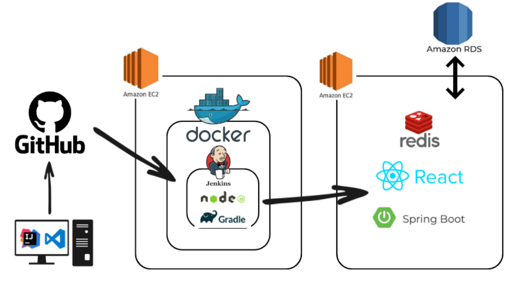

## 목차
- [프로젝트 정보](#-랜덤-자리-배치-프로젝트)
- [구조](#-구조)
- [주요 관심사](#-주요-관심사)

# 🚀 경기 매칭 웹 프로젝트

## 🔍 소개
&nbsp; 부트캠프 파이널 프로젝트로 **축구(풋살) 경기 매칭 사이트**를 구현했습니다. 

### 주요 기능
- 회원 가입 후, 팀을 생성하거나 가입 신청을 할 수 있습니다.
- 경기를 위해 상대 팀이나 대리자가 필요한 경우, 모집 혹은 경기 신청을 할 수 있습니다.
- 경기 종료 후 승패를 기입할 수 있으며 이를 통해 순위를 부여합니다.
  

### 기간 (약 2달)
&nbsp; 23.11.21(화) ~ 23.12.21(목)

### 인원 (6인)
|팀원|포지션| 담당 서비스        |
|---|---|---------------|
|김정훈|Logging + Notion| User Service  |
|박경리|FrontEnd| Game Service  |
|임승연|CI/CD| Admin Service |
|이준희|Chief| Game Serivce  |
|전준형|DBA| Admin Service |
|한신우|Development| Team Service  |

## 🔧 사용 기술 및 개발 환경

- **IDE & build**: IntelliJ, Gradle
- **[Front-end](https://github.com/junheiLee/ssonsal-fe) & Design**: React, HTML, CSS, Figma
- **Back-end**: Java 11, Spring boot 2.7.17, Spring framework, Spring Data JPA, QueryDSL
- **Security**: Spring security, JWT
- **DB& Storage**: MySQL 8, Redis, Amazon RDS / S3
- **DevOps**: AWS EC2, Docker, Jenkins
- **Tools**:  Git

# 🏗 구조
## 🗺 시스템 아키텍처

## 💾 ERD

# 😍 주요 관심사
- 컨벤션
  - Google Java Style Guide 준수
- 문서화
  - 우선 순위 기준 기능 명세
  - api 명세
- 설계 및 구현
  - Restful한 API
  - 객체지향적 설계 및 구현
